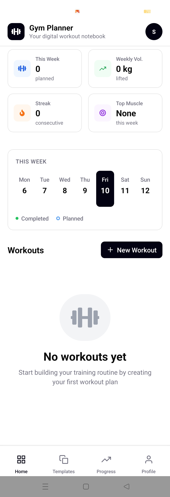
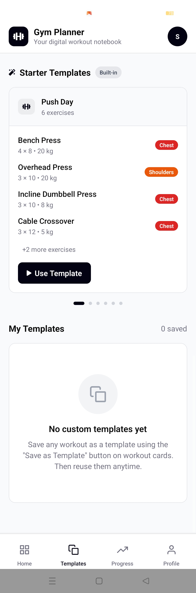
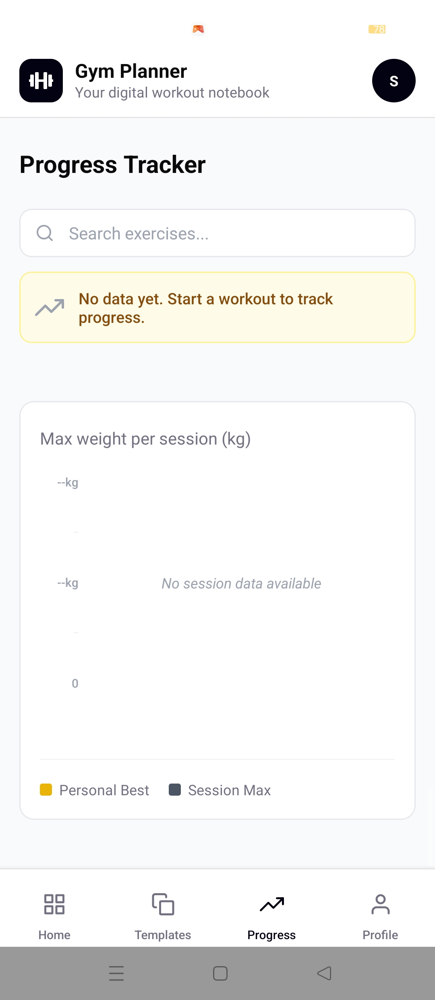

# LogLift 👋


A professional, high-performance gym tracking application built with **Expo** and **React Native**. Designed for serious athletes who demand a seamless, premium interface for planning and tracking their fitness journey.

---

## ✨ Features

- **🚀 Real-time Tracking**: Log sets, reps, and weights with an intuitive, distraction-free interface.
- **📋 Custom Templates**: Effortlessly create, save, and reuse your favorite workout routines for consistent training.
- **📈 Progress Analytics**: Visualize your gains with beautiful, interactive charts and automatic KG/LB unit conversion.
- **🎨 Premium UI/UX**: Experience fluid staggered animations and a sleek, modern dashboard powered by `react-native-reanimated`.
- **📅 Stats & Consistency**: Monitor your weekly volume, completed sessions, and key metrics at a glance with the `StatsStrip` and `WeeklyCalendar`.

---

## 🛠️ The Process

1.  **Plan**: Customize your training by building routines from scratch or using your saved templates.
2.  **Execute**: Jump into an **Active Workout** session designed for maximum Focus and minimal friction.
3.  **Track**: Log every set. Watch as the UI provides instant, satisfying feedback on your completion.
4.  **Analyze**: Dive into the **Progress** tab to see your historical data transformed into actionable insights.

---

## 🖼️ UI/UX Showcase

> [!TIP]
> This section is reserved for your project screenshots. Replace the placeholders below with your actual UI captures!

| Dashboard View | Templates View | Progress Analytics |
| :--- | :--- | :--- |
|  |  |  |

---

## 🚀 Getting Started

### 1. Install dependencies

```bash
npm install
```

### 2. Start the app

```bash
npx expo start
```

In the output, you'll find options to open the app in a:
- [Development build](https://docs.expo.dev/develop/development-builds/introduction/)
- [Android emulator](https://docs.expo.dev/workflow/android-studio-emulator/)
- [iOS simulator](https://docs.expo.dev/workflow/ios-simulator/)
- [Expo Go](https://expo.dev/go), a limited sandbox for trying out app development with Expo.

---

## 💻 Tech Stack

- **Framework**: [Expo](https://expo.dev) / [React Native](https://reactnative.dev)
- **Navigation**: [Expo Router](https://docs.expo.dev/router/introduction) (File-based)
- **Animations**: [React Native Reanimated](https://docs.swmansion.com/react-native-reanimated/)
- **UI Components**: Custom high-fidelity components (StatsStrip, WeeklyCalendar, WorkoutCard)
- **Persistence**: Context-based state management

---

## 🤝 Community & Support

Join the community of developers creating universal apps with Expo.

- [Expo documentation](https://docs.expo.dev/)
- [Expo on GitHub](https://github.com/expo/expo)
- [Discord community](https://chat.expo.dev)
